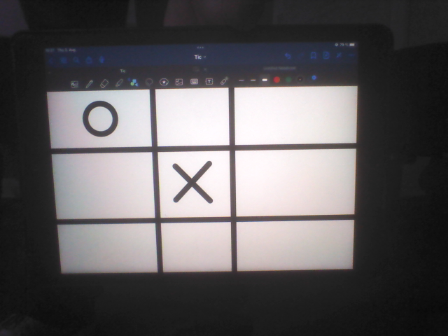
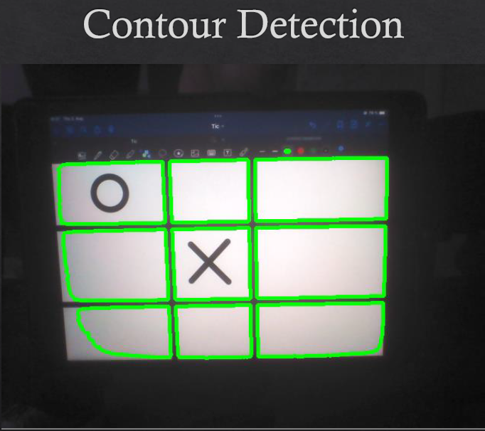

# NAOQI TIC-TAC-TOE Robot

### Dependencies

- python 2.7
- naoqi sdk
- naoqi python sdk
- Pillow

### Testing

Change the IP and Port in the `config.py` file to match your robot's IP and Port. Running the `main.py` file will start the the robot and let it recognize images such as:

### How it works

The symbol classification is based on `Solidity`, aka. proportion of the Contour area to the convex hull area.
